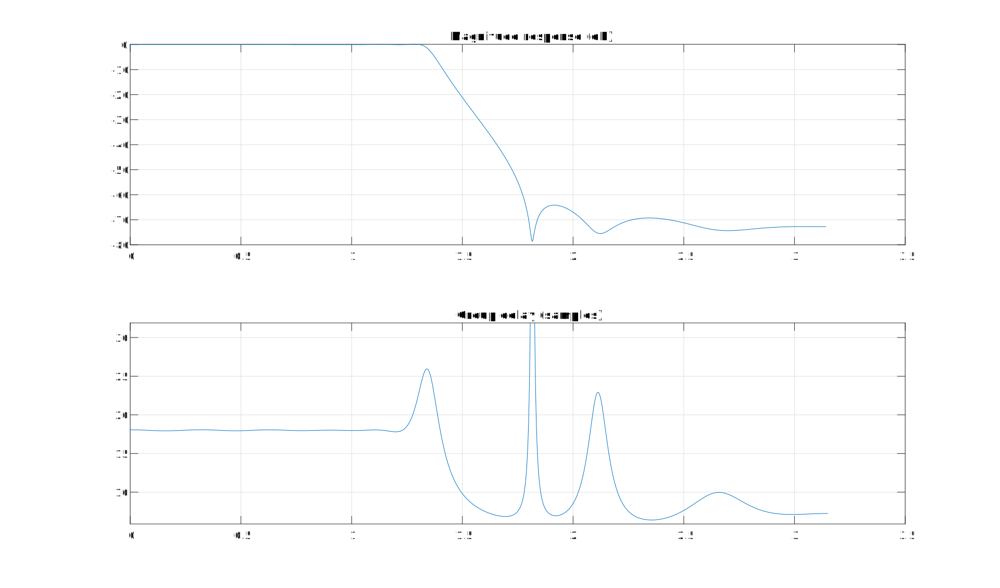
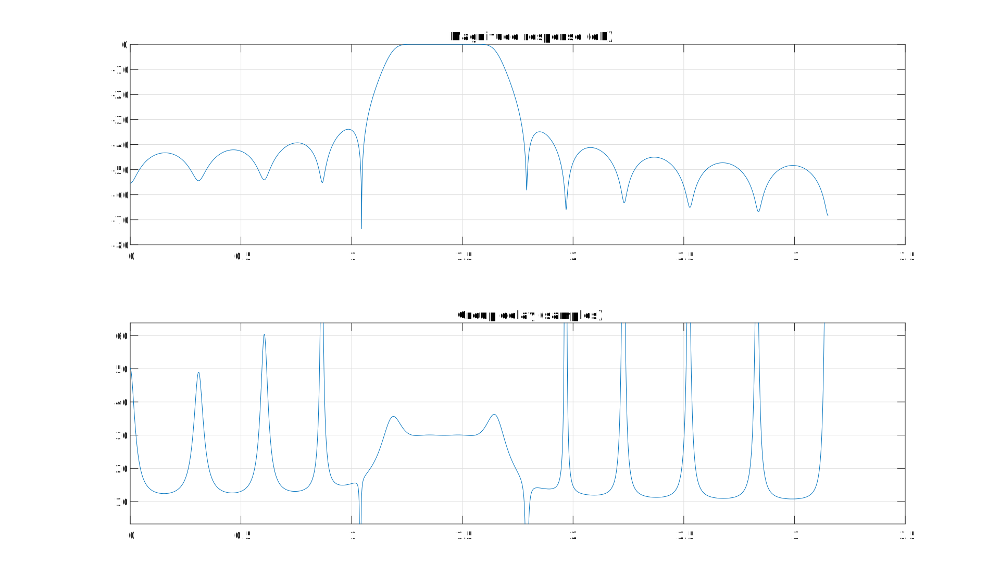
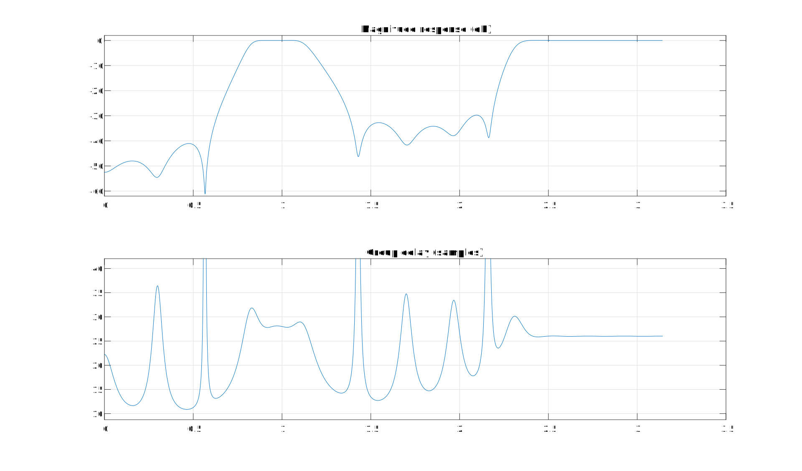

# Least square IIR filter design
## Design IIR filter with least square based method

Compute L2 solution by iteratively solving overdetermined linear equations.

User must specify desired complex frequency response and inital weights to weight the error on frequency grid.

Equation error method IIR filter design algorithm is written by Mathias C. Lang

# Examples:
## Passband linear phase low pass IIR filter


## Passband linear phase band pass IIR filter


## Passband linear phase arbitrary bands IIR filter


# Discussion

## FDLS vs Eqnerror
All 3 methods design digital filter base on arbitrary frequency grid and gain vector as input.

From filter designer perspective, this property is very desirable.

Designer once have to craft frequency response equations on s-plane and convert them to z-plane using bilinear transform.

Using these 3 methods, designers can convert their analog frequency requirements to digital IIR filter directly.

Frequency domain least square(FDLS) method did pretty good job at preserving high frequency of the analog filter.

In my opinion, FDLS is easy version of Matched Z-transform, they both has potentials on designing filter that need to preserve frequency response around Nyquist. Although they work in completely different way.

However, FDLS shouldn't be used if you need linear phase passband requirement, FDLS simply cannot handle sudden changed peaks in desire response.

# License and alternative
mldivide and it's belonging algorithm is mostly generated by Matlab coder, but I still put GNU license on it.

The mldivide code have been modified, some redundant memory allocation have been removed manually.

DO NOT RELY on Matlab generated code if you need computational efficiency!!! Matlab is a column-major order language, while we don't do that in most other programming languages.

If user don't like the mldivide, you can simply replace mldivide with following logic:
```
if is_square_matrix(A)
   return inv(A) * vector;
else
   return pinv(A) * vector;
```
inv() can be implemented using LU decomposition, or can be calculated using determinant.

pinv() is implemented using Singular value decomposition (SVD).

Either mldivde or above method do not provide good numerical stability.

Mathworks documentation provide a good way to achieve good numerical stability matrix inversion, which is out-of-scope topic.
