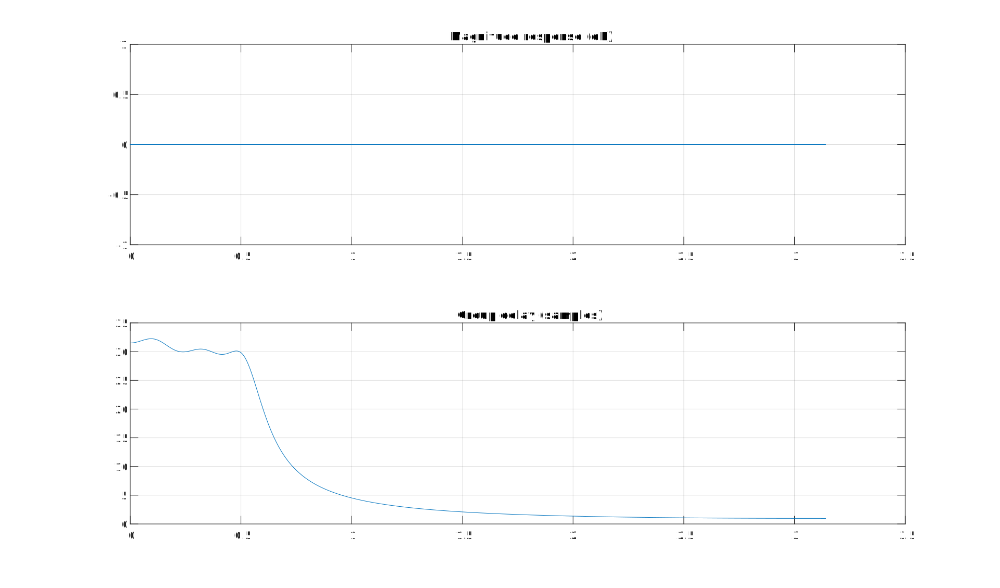

# Open Signal Processing Toolbox
## Least square IIR filter design
#### Design IIR filter & system identification with least square based method in C

Compute L2 solution by iteratively solving overdetermined linear equations.

User must specify desired complex frequency response and inital weights to weight the error on frequency grid.

Equation error method IIR filter design algorithm is written by Mathias C. Lang

## Examples:
#### Passband linear phase low pass IIR filter


#### Passband linear phase band pass IIR filter


#### Passband linear phase arbitrary bands IIR filter


#### Group delay only IIR filter (Allpass filter)


## Discussion

#### FDLS vs Eqnerror
Both FDLS and eqnerror design digital filter base on arbitrary frequency grid and gain vector as input.

From filter designer perspective, this property is very desirable.

Designers once have to craft frequency response equations on s-plane and convert them to z-plane using bilinear transform.

With FDLS or eqnerror, designers can convert their analog frequency requirements to digital IIR filter directly without making their own equation.

Frequency domain least square(FDLS) method did pretty good job at preserving high frequency of the analog filter.

In my opinion, FDLS is easy version of Matched Z-transform, they both has potentials on designing filter that need to preserve frequency response around Nyquist. Although they work in completely different way.

However, FDLS shouldn't be used if you need linear phase passband requirement, FDLS cannot handle abrupt changes in desired response.

## License and alternative
mldivide and matrix inversion related algorithm is the only part of the code that is generated by Matlab coder, however I still decide to put GNU license on it, the internal algorithm of generated mldivide do not work like Mathworks's *implemented* mldivide, the Matlab one is more complicated and numerically stable, so that a completely differrent algorithm to solve linear equations, I don't think there's any license violations.

Thanks to fixed matrix dimension code generation, the generted mldivide function in C is pretty clean and readable.

However we need to add support to arbitrary matrix dimension, so C version of mldivide have been heavily modified, many redundant memory allocation steps have been removed manually.

DO NOT RELY on Matlab generated code if you need computational efficiency!!! Matlab is a column-major order language, while we don't do that in most other programming languages.

If user don't like the mldivide, you can simply replace mldivide with following logic:
```
if is_square_matrix(A)
   return inv(A) * vector;
else
   return pinv(A) * vector;
```
However, I still encourage user implement their own mldivide using LAPACK. Matrix preconditioner may available in some of their algorithms, making the solver become blazingly more robust.

inv() can be implemented using LU decomposition, or can be calculated using determinant.

pinv() is implemented using Singular value decomposition (SVD).

Either mldivde or above method do not provide good numerical stability.

Mathworks documentation provide a good way to achieve good numerical stability matrix inversion, which is out-of-scope topic.

## General transfer function toolbox
### Implemented function

### cplxpair

#### Description
Sort complex numbers into complex conjugate pairs

#### Use
What we know is correct algorithm will generate correct answer, but roots computed by polynomial root finding algorithm doesn't guarantee to be sorted.
In order to make sure second order section grouped correctly, grouping complex conjugate pairs is required

### zp2sos

#### Description
Convert filter poles and zeros to second-order sections.

#### Use
Convert poles and zeros into second order polynomials.

### tf2sos

#### Description
Convert digital filter transfer function data to second-order sections form.

Algorithm:

1. Calculate the z-plane of transfer function
2. Uses the function zp2sos, which first groups the zeros and poles into complex conjugate pairs using the cplxpair function. zp2sos then forms the second-order sections by matching the pole and zero pairs

#### Use
Convert high order transfer function into second order biquad.